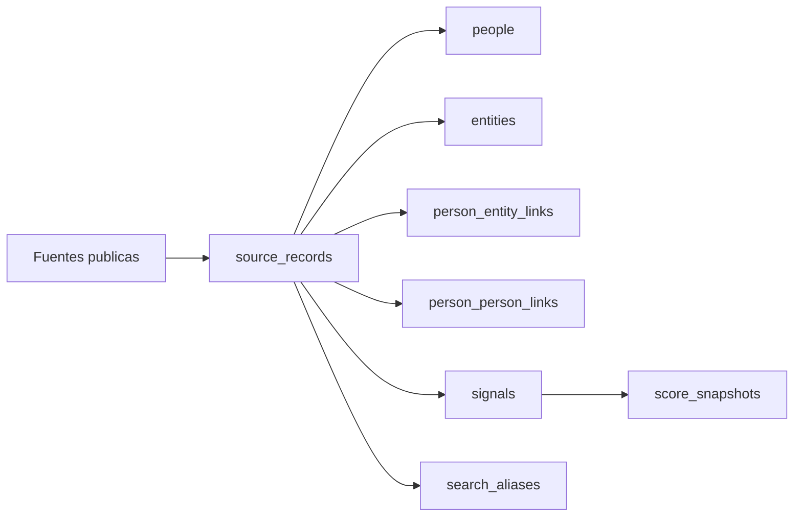

# Modelo de datos MVP

Este esquema soporta el flujo base del MVP:

1. importar evidencia desde fuentes publicas
2. asociarla a una persona canonica
3. derivar senales interpretables
4. calcular un score explicable
5. mantener trazabilidad completa hacia la fuente original

## Tablas

- `people`: registro canonico de personas conocidas por el sistema, incluyendo perfiles investigados y personas relacionadas.
- `source_records`: evidencia cruda o semi-cruda importada desde fuentes oficiales.
- `signals`: senales derivadas y homogeneas para producto, UI y scoring.
- `entities`: organizaciones o instituciones relacionadas con personas o fuentes.
- `person_entity_links`: vinculos entre persona y entidad con trazabilidad a la fuente.
- `person_person_links`: vinculos entre personas con trazabilidad a la fuente.
- `score_snapshots`: fotografias versionadas del score explicable.
- `search_aliases`: variantes de nombre para busqueda y matching.

## Relaciones principales

- `people` 1:N `source_records`
- `people` 1:N `signals`
- `people` 1:N `score_snapshots`
- `people` 1:N `search_aliases`
- `people` N:M `entities` mediante `person_entity_links`
- `people` N:M `people` mediante `person_person_links`
- `source_records` 1:N `signals`
- `source_records` 1:N `person_entity_links`
- `source_records` 1:N `person_person_links`

## Flujo operativo

## Convenciones

- Los datos crudos viven en `source_records`.
- El contexto declarativo de DJI vive en `person_entity_links` y `person_person_links`, no en `signals`.
- Las interpretaciones del sistema viven en `signals`.
- El score persistido vive solo en `score_snapshots`.
- La trazabilidad hacia la evidencia original se conserva mediante `source_record_id`.
- Las taxonomias (`source_type`, `signal_type`, `entity_type`, `link_type`, `score_level`) se modelan como texto para mantener flexibilidad en el MVP.
